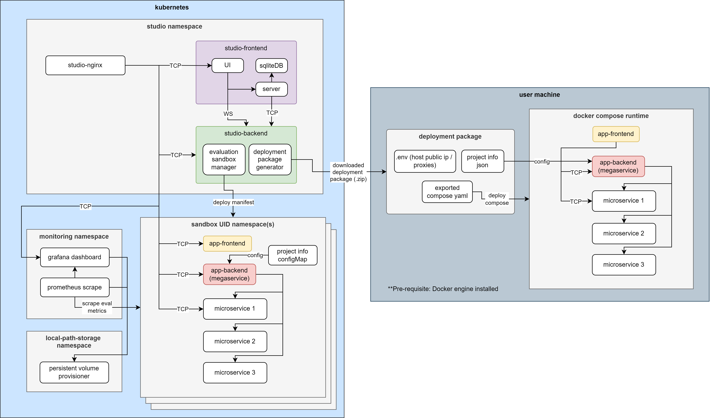
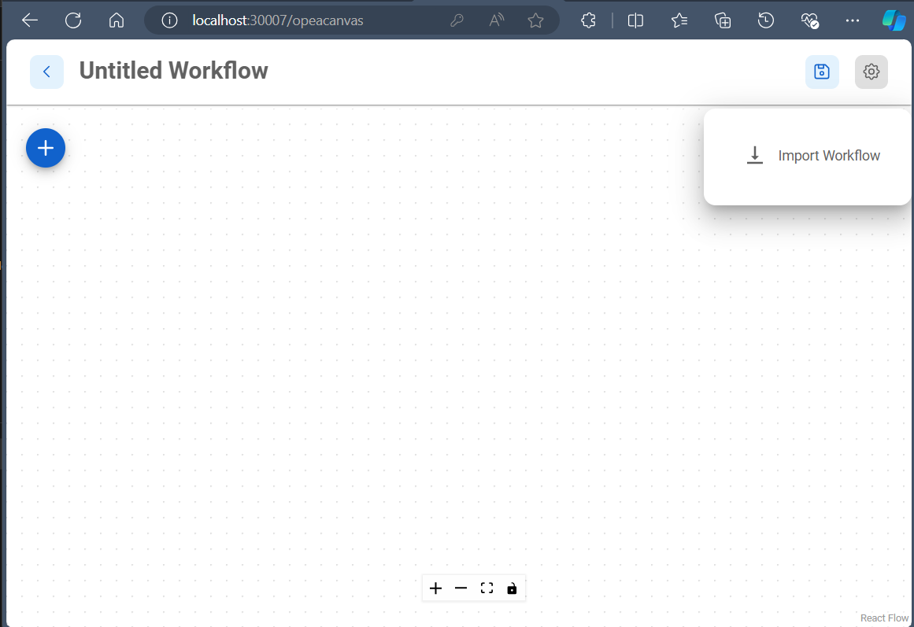
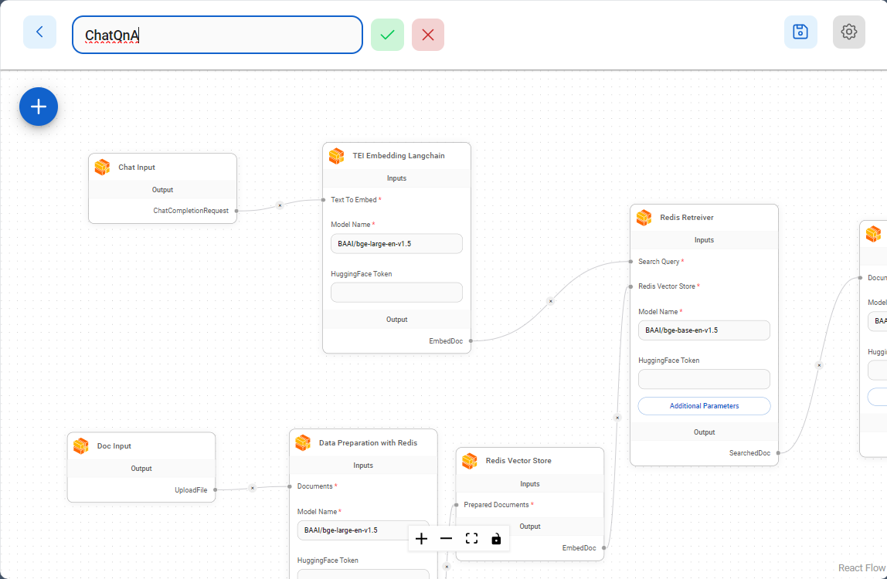

# Generative AI Studio (GenAIStudio)
 GenAI Studio streamlines the creation of enterprise Generative AI applications by providing alternate to manual processes with a seamless, end-to-end solution. From GenAI app development and evaluation to performance benchmarking and deployment, GenAI Studio empowers developers to effortlessly build, test, optimize their LLM solutions and create the deployment package. Its intuitive no-code/low-code interface accelerates innovation, enabling rapid development and deployment of cutting-edge AI applications with unparalleled efficiency and precision.


 ## Reduce Barrier of Adoption with Low-Code: End-to-End GenAI App Development for Productivity
 
  **🌟Key Capabilities**
 - 🛠️ Build & configure GenAI applications rapidly with low-code and no setup hassle
 - 🔍 Instant evaluation with sandbox on Kubernetes Namespace
 - 📊 Dynamic performance measurement & benchmarking with Grafana dashboarding via Prometheus
 - ⚙️ One-click deployment package generation for instant application setup

 GenAI Studio revolutionizes application development by eliminating the need for manual scripting. It encapsulates OPEA's GenAIComps microservices into intuitive, configurable UI blocks, enabling users to effortlessly create app workflows through a drag-and-drop interface on a GUI canvas. Once the workflow is designed, users can test its functionality in a sandbox environment within individual Kubernetes namespaces. Performance can be monitored and benchmarked using Prometheus, with detailed insights available via Grafana dashboards for each workflow and microservice. Upon completion, users can generate a deployment package that allows one-click deployment, facilitating instant application setup on their own machines. The package includes scripts for direct setup, featuring Dockerfiles for single-machine deployment and manifests for Kubernetes environments.

## Jump To:
1. [Key Components](#key-components)
   - [Kubernetes Cluster](#kubernetes-cluster)
   - [Studio UI](#studio-ui)
   - [Sandbox](#sandbox)
   - [GenAI Microservices](#genai-microservices)
   - [Deployment Package](#deployment-package)
2. [Setting up GenAIStudio](#setting-up-genaistudio)
   - [Who needs to set up the Studio?](#who-needs-to-set-up-the-studio)
   - [System Requirements](#system-requirements)
   - [Prerequisites](#prerequisites)
   - [Installation](#installation)
3. [Getting Started with GenAIStudio](#getting-started-with-genaistudio)
   - [Start a New Workflow](#start-a-new-workflow)
   - [App UI Features](#app-ui-features)
   - [Monitor Sandbox Resource Utilization in Grafana Dashboard](#monitor-sandbox-resource-utilization-in-grafana-dashboard)
   - [Download and Run GenAI App Deployment Package Locally](#download-and-run-genai-app-deployment-package-locally)
4. [Import and Run a Sample Workflow](#import-and-run-a-sample-workflow)
5. [Known Limitations](#known-limitations)
6. [Additional Content](#additional-content)

 ## Key Components


 ### Kubernetes Cluster
 The Kubernetes cluster hosts both the Studio, Sandbox and Monitoring namespaces. 
 - **Studio Namespace:** This is the core application namespace containing the Studio-Frontend and Studio-Backend. The Studio-Frontend allows users to manage workflows and build GenAI pipelines. The Studio-Backend includes the Evaluation Sandbox Manager and Deployment Package Generator, which handle deployment of user-designed pipelines.
 - **Sandbox Namespace(s):** Managed by the Studio server, these namespaces create sandbox environments where users can test and evaluate the pipelines constructed through Studio-Frontend.
 - **Monitoring Namespace:** This namespace contains a Prometheus service that collects performance data from each sandbox. These collected metrics are visualized in a Grafana dashboard, enabling users to monitor resource utilization and pipeline performance.

### Studio UI
The Studio UI consists two main pages.
- **Main Page:** Provides an overview of the workflow list, allowing users to easily manage workflows, launch sandboxes, download deployment packages, and manage package manifests.
- **Canvas Page:** A drag-and-drop interface built on Flowise, enabling users to build GenAI applications by assembling various configurable microservice blocks into a GenAI pipeline. These microservices form the core components necessary for creating Retrieval-Augmented Generation (RAG) applications. The pipeline can be run and tested within the Studio’s Sandbox environment.

### Sandbox
A sandbox is automatically created when user constructed a workflow through Studio UI. Each sandbox runs independently, allowing for performance testing and monitoring. The sandbox namespace, managed by the Studio-Backend, contains necessary microservices based on the pipeline constructed and includes a App UI. Users can test the pipeline's inference performance and track resource utilization via an integrated Grafana dashboard.

### GenAI Microservices
GenAIStudio currently supports a subset of microservices from GenAIComps, including [DataPrep with Redis](https://github.com/opea-project/GenAIComps/tree/main/comps/dataprep/redis), [TEI Embedding](https://github.com/opea-project/GenAIComps/tree/main/comps/embeddings), [Retriever with Redis](https://github.com/opea-project/GenAIComps/tree/main/comps/retrievers/redis), [Reranks](https://github.com/opea-project/GenAIComps/tree/main/comps/reranks), [LLMs](https://github.com/opea-project/GenAIComps/tree/main/comps/llms) and [Guardrails](https://github.com/opea-project/GenAIComps/tree/main/comps/guardrails). This list is expected to grow in future releases, expanding the range of services available for building and testing GenAI pipelines.

### Deployment Package
Users can download the deployment package in a ZIP file from the Studio UI and deploy it locally using Docker Compose. This local setup mirrors the sandbox environment, providing the same application configuration and microservices. It enables users to seamlessly deploy the GenAI application constructed in GenAIStudio on their local machine with no hussle.

## Setting up GenAIStudio
### Who needs to set up the Studio?
  
If you're part of a team and want to provide a testing playground for your members, you'll need to set up GenAIStudio. This setup allows your team members to test and evaluate their pipelines in a sandbox environment without worrying about infrastructure management.

However, if you already have access to an existing Studio instance, you can skip the setup process and move directly to the next section to begin working with your workflows.

### System Requirements
```
Memory: >64GiB (To run a ChatQnA Sandbox, approx. 45GiB memory is needed)
Storage: >100GiB
OS: Linux Debian-based distribution
```
_Note: This setup has been validated on a system running Ubuntu 22.04 on an Intel(R) Xeon(R) Platinum 8468 server with 1000GB memory and 300GB local storage._

### Prerequisites
GenAIStudio requires an on-premise Kubernetes cluster. If your server does not have Kubernetes set up, please install by following the [Kubernetes official setup guide](https://kubernetes.io/docs/setup/). Alternatively, you can try out our [setup onpremise kubernetes script](./setup-scripts/setup-onpremise-kubernetes/readme.md).

_Note: GenAIStudio have only been validated in a single node bare-metal kubernetes setup using [setup onpremise kubernetes script](./setup-scripts/setup-onpremise-kubernetes/readme.md)._

### Installation
The installation is done using genai-studio playbook script. The script will
- Deploy a persistent volume for prometheus and a customized monitoring stack based on prometheus-community/kube-prometheus-stack (which contains both Prometheus and Grafana) in the monitoring namespace.
- Deploy the studio-backend, studio-frontend and also a studio-nginx in the studio namespace.

The installation can be done with the following steps:

1. **Clone this repo to your server.**
	```sh
	git clone https://github.com/opea-project/GenAIStudio
	cd GenAIStudio
	```
2. **Run the commands below**
	```sh
	sudo apt install ansible -y
	cd setup-scripts/setup-genai-studio
	ansible-playbook genai-studio.yml
	```
	_Note: you can review the deployment configurations in [genai-studio.yml](./setup-scripts/setup-genai-studio/genai-studio.yml)_
	

## Getting Started with GenAIStudio 

You can access the the Studio UI in a web browser at `http://<studio_server_ip>:30007`.
 
#### Start a New Workflow
1. **Create a new workflow:** 

	On the `Main Page`, click **Create New Workflow**. This will open a blank `Canvas Page` where you can start building your new project.

	

2. **Drag-and-drop microservice nodes:** 

	In the top-left corner of the canvas, click the ➕ **Add Nodes** button to view a dropdown list of available microservice nodes. You can expand each category and drag nodes onto the canvas. Use your mouse scroll to zoom in and out of the canvas for easier navigation.

	

3. **Configure and connect microservice nodes:** 

	Some nodes have configurable parameters that let you set specific settings. After configuring a node, you can connect it to another node by dragging the output edge and dropping it onto the input edge of the target node. Once your workflow is complete, click the 💾 **Save Workflow** button to save your project.

	

4. **Run a Sandbox:** 

	Back on the **Main Page**, you’ll see the saved workflow under the Workflow list. Click the ▶️ **Start button** to initiate the sandbox environment for your workflow. Please allow 3-5 minutes for the environment to be fully set up. Once ready, you can test the workflow in the Sandbox App UI and monitor resource usage through the Grafana Dashboard.

	

#### App UI Features
1. **Conversational Interactions with Custom Settings**

	Engage in a conversation with the chatbot using various parameter settings. The chatbot’s responses will be tailored based on the content in the uploaded data sources.

	

2. **Upload Data Sources.**

	Add data sources by uploading files (supported file types: .pdf, .docx, and .txt) or by inserting multiple URLs to online articles.

	

#### Monitor Sandbox Resource Utilization in Grafana Dashboard
- View real-time resource utilization metrics for the Sandbox environment. CPU and memory usage are tracked and visualized in the Grafana dashboard for easy monitoring.

	

### Download and Run GenAI App Deployment Package Locally	
#### Prerequisites
To deploy the downloaded GenAI application locally, ensure that Docker Engine with Docker Compose are installed on your machine. If you haven't installed them yet, please refer to the official [Docker](https://docs.docker.com/engine/install/) documentation for setup instructions.
	
#### Deploying a GenAI Application
The downloaded zip file includes the necessary configurations for deploying the microservices. Follow these steps to set up and run the application with Docker Compose:

1. Set the `public_host_ip` environment variables in `.env` or export it in your environtment:

   ```bash
   # Note: public_host_ip is an external public IP
   # ./.env
   public_host_ip=192.168.1.1
   ```

	If you’re in a proxy environment, add or export the relevant proxy settings:

	```bash
	# ./.env
	public_host_ip=192.168.1.1
	http_proxy="Your_HTTP_Proxy"
	https_proxy="Your_HTTPS_Proxy"
	no_proxy="Your_No_Proxy,app-nginx,app-frontend,app-backend,...Other_Compose_Services"
	```

	**Note:** To find your public host IP, you can run the following command in your terminal:

    ```bash
    curl ifconfig.me
    ```

2. Start the application using Docker Compose:

    ```bash
    docker compose -f compose.yaml up -d
    ```

3. Access the application by opening your web browser and go to:

    ```bash
    http://<public_host_ip>:8080
    ```

## Import and Run a Sample Workflow

Get started quickly with the Studio UI by downloading and importing this [sample workflow](./sample-workflows/sample_workflow_chatqna.json), which deploys a ChatQnA application.

1. On the Studio main page, create a new workflow. Then, click on the ⚙️ button in the header bar to import a workflow.

	

2. Rename the workflow to "ChatQnA" and review the settings in each node. Enter your Hugging Face token in the relevant nodes, then save the workflow.

	

3. Return to the main page and click the run button to launch the sandbox.

## Known Limitations
- **Having more than one same microservice node within the same workflow is not allowed.** The sandbox execution of a workflow with more than one instance of the same microservice node will fail.
- **Only deployment on CPU is supported** in current GenAIStudio release. Support for GPU or other devices will be available in future release.

## Additional Content

- [Code of Conduct](https://github.com/opea-project/docs/tree/main/community/CODE_OF_CONDUCT.md)
- [Security Policy](https://github.com/opea-project/docs/tree/main/community/SECURITY.md)
- [Legal Information](LEGAL_INFORMATION.md)