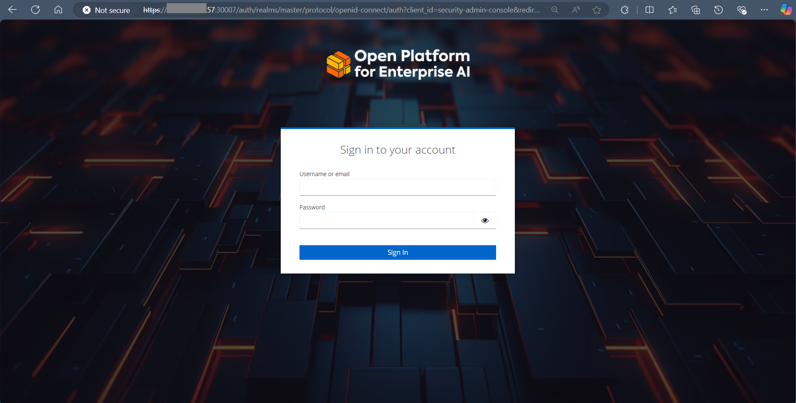

# Admin Console Configuration Guide

In OPEA v1.2 release, [Keycloak](https://github.com/keycloak)-based access management is integrated into GenAI Studio to enable multi-user tenancy. This allows admins to perform access control actions effieciently over Studio users, while users can manage their own workflows securely. 

Overall, admins can perform the following actions in the admin console:

- Manage Studio users with Create, Read, Update, and Delete (CRUD) operations.
- Configure URLs for redirections.
- Apply an OPEA-based theme to the admin console and login pages.

The Keycloak microservice is included as part of the GenAI Studio setup. You can review its configurations in the [Studio deployment manifest](../../setup-scripts/setup-genai-studio/manifests/studio-manifest.yaml) and customize values such as the admin name and admin password. These credentials will be used for the first-time login to the admin console.

## Admin Console Login

To access the admin console, navigate to:
`https://<studio_server_ip>:30007/auth/admin/master/console/#/genaistudio`

Log in using the first-time credentials set in the Studio deployment manifest (default username: admin, password: admin)
After logging in, you will see the following page:

To reset the admin login credentials, navigate to the Account Console from the admin dropdown located in the top-right corner of the page, as higlighted.

## Admin Console Navigation

### Realms and Clients

1. In the Keycloak Admin Console, you will find a pre-created realm named `genaistudio`. Navigate to the `Clients` tab in the left panel, where you will see a client named `genaistudio` within this realm. Click on the `genaistudio` client to review its configurations.

    

2. Under the Settings tab of the `genaistudio` client, you can review the preconfigured URL redirection settings. These settings are configured to work by default and generally do not require modification unless necessary.

    

### Users and Groups

1. Navigate to the `Users` tab to view the list of registered users. Here, you can modify user information and credentials or click the `Add user` button to create a new user.
_(Note: New users can also register themselves via the OPEA GenAI Studio login page.)_

    

2. Enter the basic information for the new user, then click the `Create` button to create a new user.

    

3. After creating the user, you will be redirected to the `User Details` page. Go to the `Credentials` tab to set a password for the new user.

    

4. To approve the new user for GenAI Studio access, navigate to the `Groups` tab. By default, all newly registered users are assigned to the `unauthorized_user` group. Click the `Leave` button to remove the user from this group.

    

5. Next, click the `Join Group` button, select the appropriate group for the user, and click `Join` to confirm.

    

6. __Group Definitions__:
    - __admin__: Admin users can view and modify workflows for all users in the studio.
    - __unauthorized_user__: Newly registered users are assigned to this group by default. Unauthorized users cannot access the GenAI Studio.
    - __user__: Regular studio users who have access to all features of the studio but cannot view workflows created by other users.

### Admin Console and Login Theme

We have prepared OPEA-based login theme for admin console. To enable it, switch to `Keycloak master` realm and navigate to `Themes` tab under `Realm settings`. Choose `opea` from the `Login theme` and `Admin theme` dropdowns. Click on `Save` button to apply the changes.

 

After reloading the page, the new theme will be applied to the `genaistudio` realm.

 

 The OPEA theme will also replace Keycloak's default theme on the admin console login page.

  

